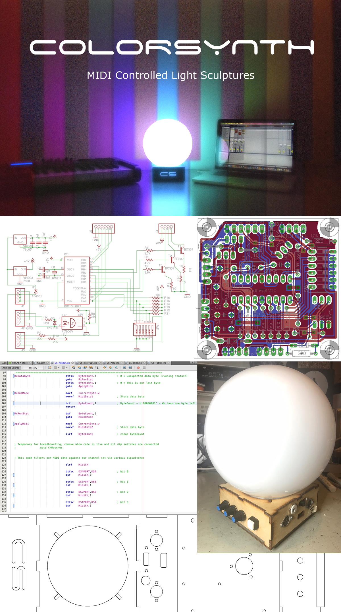
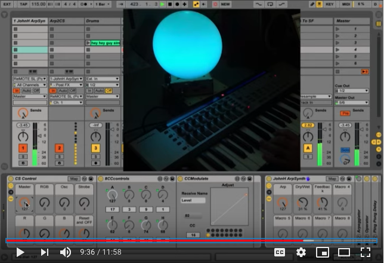

# ColorSynth 
MIDI Controlled Light Synthesizer 
Created by Eric Bateman

ColorSynth is a MIDI controlled sculpture and light synthesizer.  
* Lightning fast strobe and oscillators, written in PIC assembly
* Super bright 3W RGB LEDs
* Power over MIDI, daisy chainable
* Responds to note on and control change events, instant lighting for your MIDI equipped instrument

Visit http://www.colorsynth.com
